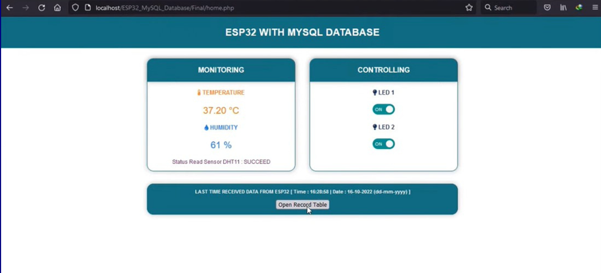
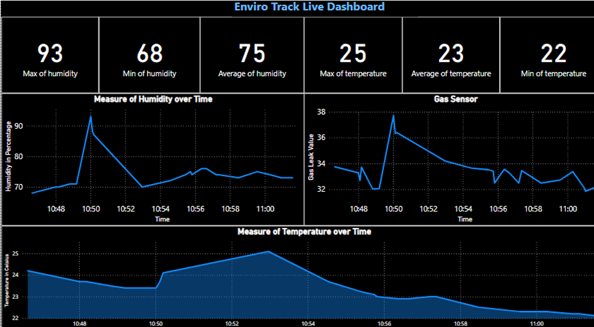

# 🌱 EnviroTrack - Web Enabled Vest Monitoring System

**A real-time IoT-based environmental monitoring system with alert mechanisms and analytics dashboard, designed to enhance safety in industrial and labor-intensive environments.**

## 🚀 Features

- Real-time sensor data monitoring (Temperature, Humidity, Gas levels)
- Wireless alert mechanism using ESP32 & web-based trigger
- Data logging into MySQL with structured storage
- Web dashboard for live readings and historical records
- Interactive analysis dashboard using Power BI Services

## 🛠️ Tech Stack

- **Hardware:** ESP32, DHT11 (Temp & Humidity), MQ135 (Gas)
- **Frontend:** HTML, CSS, JavaScript
- **Backend:** PHP, MySQL (XAMPP Localhost)
- **Dashboard:** Power BI (Cloud-Based Service)
- **IDE:** Arduino IDE for firmware programming

## 🧠 Architecture Overview

- ESP32 collects sensor data and transmits to a PHP server via HTTP POST.
- PHP backend logs and stores data in a structured MySQL database.
- Web interface fetches and displays real-time data in a table and graphical format.
- Power BI integrates via MySQL to visualize trends and analysis dashboards.
- Alarm alerts are triggered wirelessly from the web to ESP32 based on critical thresholds.

## 📊 Screenshots
### 🔹 Home Page With Alert System

### 🔹 PowerBI_Dashboard

### 🔹 Record Table

## 📈 Future Scope

- Add edge computing for local decision-making.
- Dual-mode operation (Offline + Cloud).
- Integrate AI-based predictive alerts and analytics.
- Compliance-based reporting automation for industry standards.

## 📄 Presentation Summary

- Built for inter-college research competition "Aavishkar"
- Addressed critical health risks due to lack of environmental monitoring in hazardous workplaces.
- Designed with scalability, real-time data accuracy, and user-friendly web interface in mind.

## 🤝 Team

- Tejas Patil  
- Arnav Nadkarni  
- Vishwajeet Panaskar  
- Vinayak Panchal  

## 📬 Contact

Feel free to reach out: [patiltejas25012003@gmail.com](mailto:patiltejas25012003@gmail.com)

---

